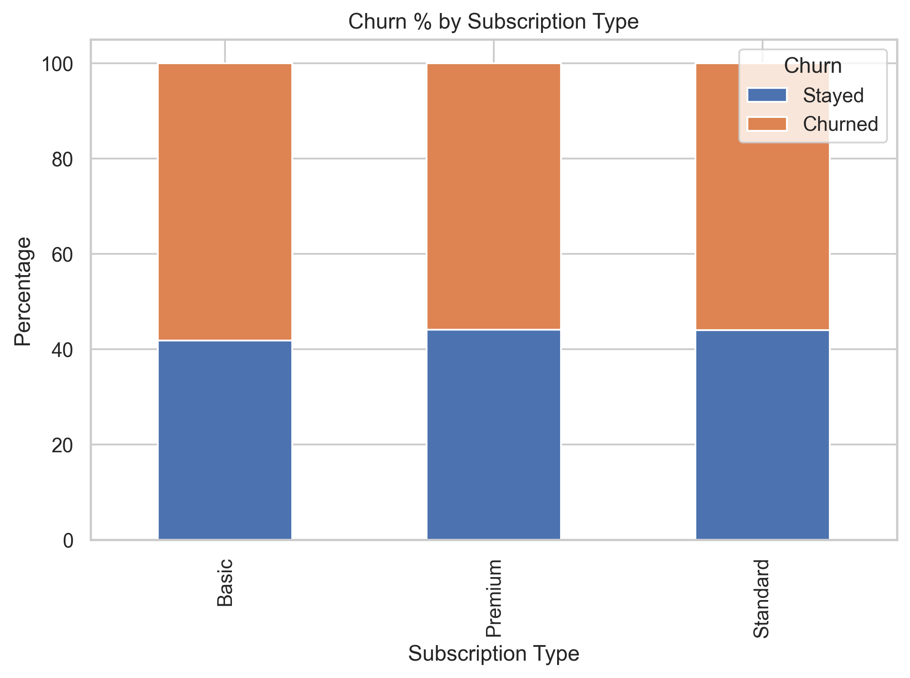
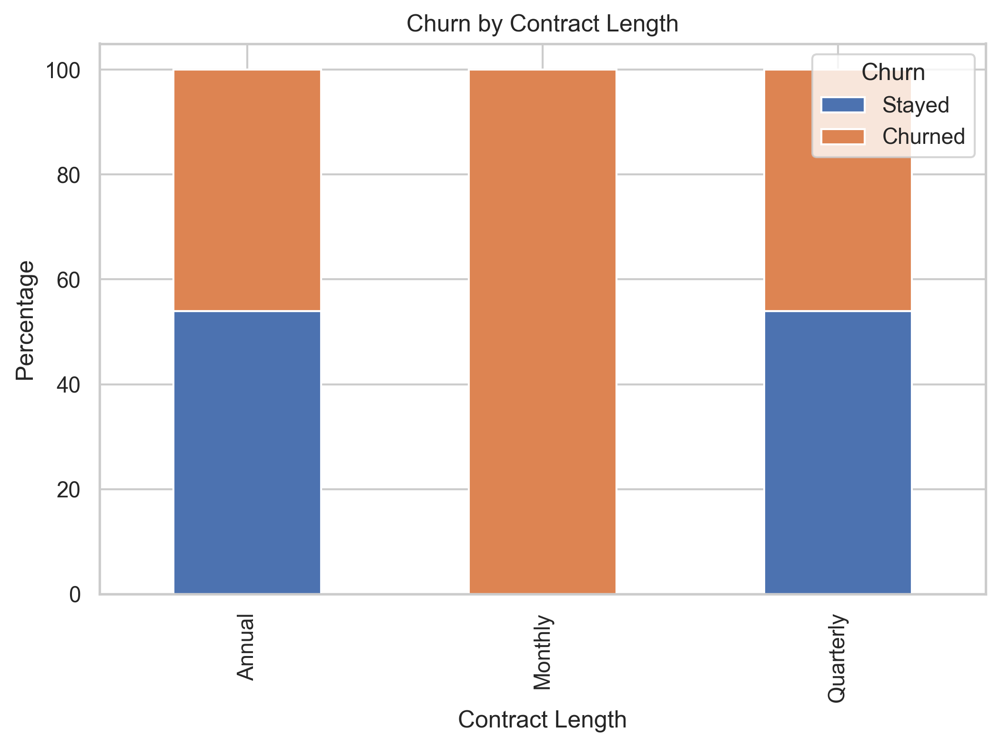
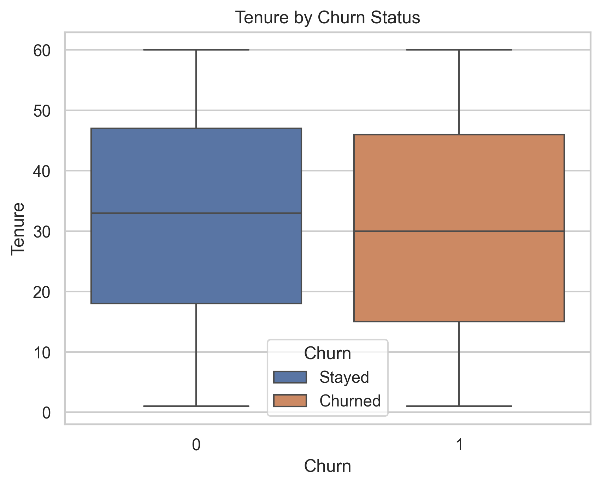
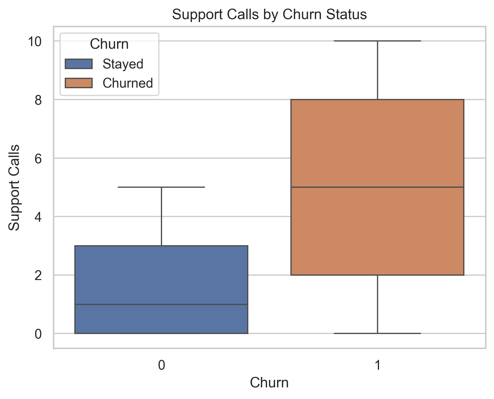
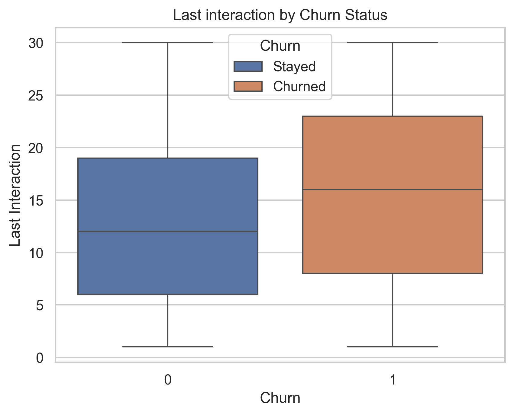
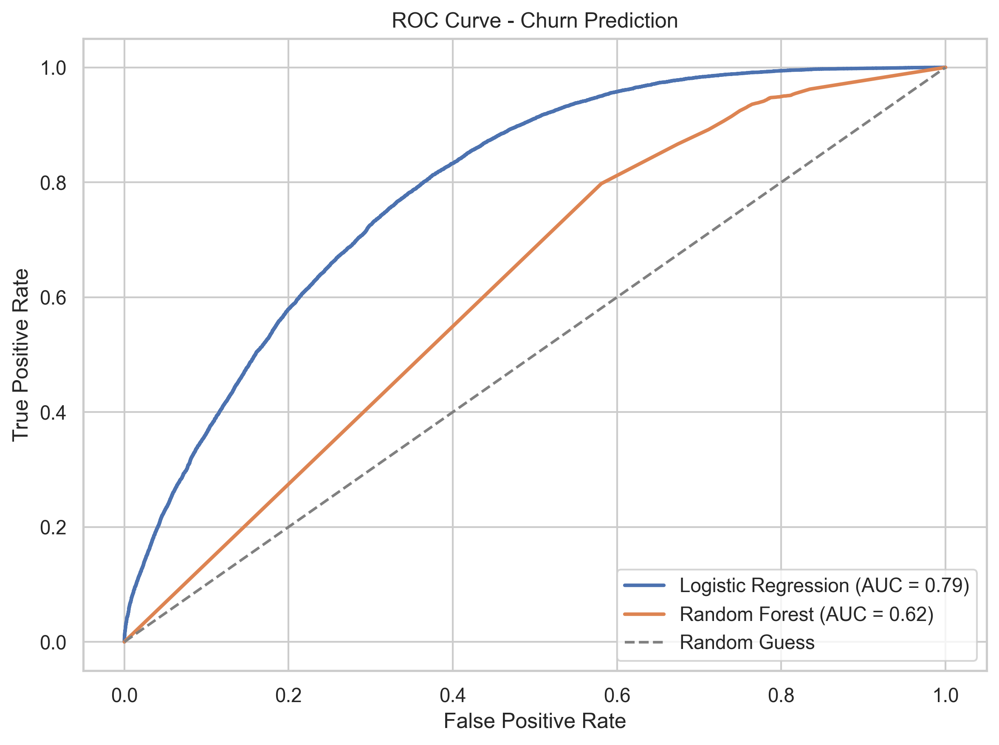
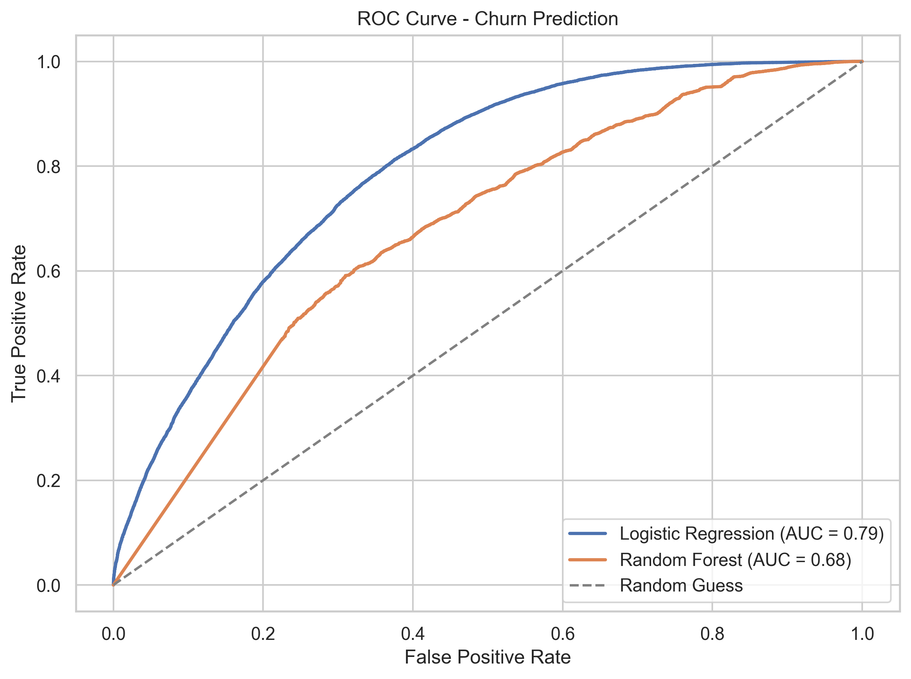
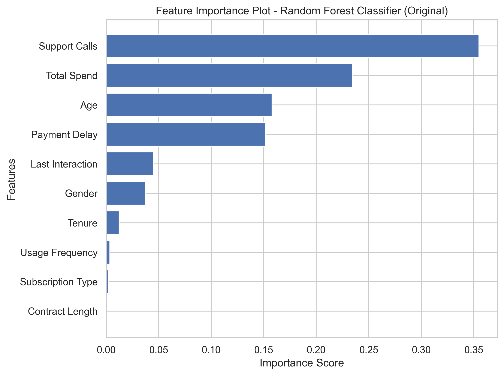
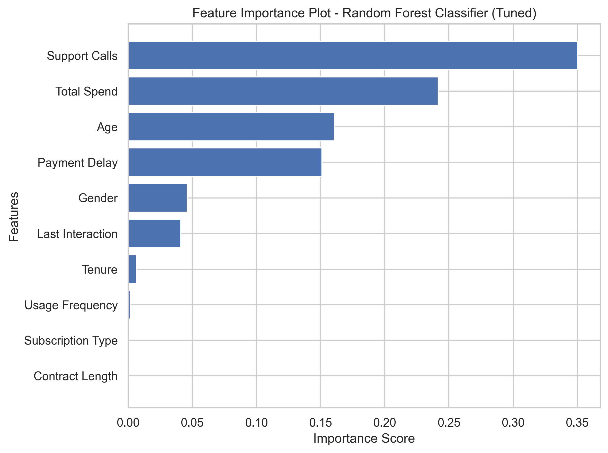
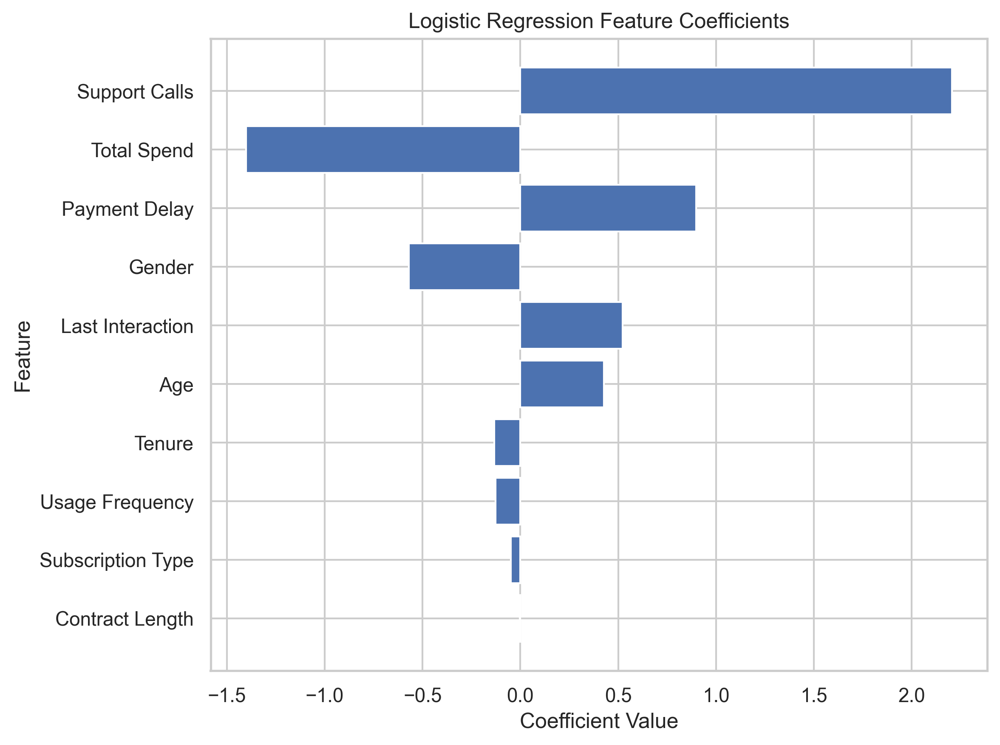

# SaaS Customer Churn Analysis

Comprehensive churn analysis for a fictional SaaS company using real-world styled data from kaggle (https://www.kaggle.com/datasets/muhammadshahidazeem/customer-churn-dataset). This project applies logistic regression and random forest models to predict customer churn and is supported by an exploratory analysis of its features and data composition through visualization. Key performance metrics, model comparisons, and business recommendations are included to inform customer retention strategies.

---

## Purpose

This project aims to identify drivers of customer churn and build predictive models that enable proactive retention efforts. The analysis combines rigorous data preprocessing, interpretable modeling, and visual storytelling to demonstrate how machine learning can be applied in a SaaS business setting.

---

## Dataset Overview

- **customer_churn_dataset-training-master.csv**: Training data for model development  
- **customer_churn_dataset-testing-master.csv**: Holdout test set for validation

---

## Tech Stack

- **Python** (pandas, matplotlib, seaborn, scikit-learn, Standard Scaling, Label Encoding)  
- **Jupyter Notebook** (EDA, modeling, visualization)  
- **GitHub Pages + Jekyll** (Portfolio publishing)

---

## Key Questions Answered

### 1. What features best predict whether a SaaS customer will churn?
### 2. Can we build an interpretable, accurate model to identify at-risk customers?
### 3. How do customer behaviors (e.g. support calls, payment delays, tenure) relate to churn likelihood?

---

## Analysis Findings

**Churn Rate**
0  -  52.631497;
1  -  47.368503;
- Minimal Skew in Churn values.
- Essential to know for adequate and effective modeling techniques.

### Logistic Regression
- predicted churn rate accurately over 71% of the time.
- Caught 77% of all real churners — strong recall.
- Solid overall balance between false positives and false negatives.

#### Logistic Regression Coefficients
- Churn is mostly driven by elevated support calls (2.206015), delayed payments (0.898523), and inactivity (0.522829). Meanwhile, customers who spend more (1.402743), use the platform frequently (-0.127561), or have longer tenure (-0.133455) are significantly less likely to churn. 
- Age (+0.43) had a modest positive effect, while Gender (–0.57) indicated a lower churn likelihood for males (assuming label encoding).
- Subscription Type and Contract Length showed minimal predictive influence in the current model.
- These insights can guide retention campaigns that prioritize high-risk exhibiting the risk factors users and reinforce loyalty among engaged and high-value customers.

### Random Forest Classifier (non-tuned)
- predicted churn rate accurately over 55% (rounded up ~ .54502) of the time - an esitimate comparable to a random guess.
- Exhibits strong recall at 95% but subpar precision at 50%, indicating the model correctly identifies most of the churners but misclassifies non-churners at a rate comparable to randomly guessing.
- Random Forest Classifier misclassifies many loyal customers as churners, an insight that could result in wasteful expenditure of retention resources that could damage relationships.

### Random Forest Classifier (tuned)
- Adjusted the hyperparameters to improve performance and achieve a more accurate ROC Curve and AUM estimates.
- Tuninng our model ensures reduction in negative effects of overfitting and improvement in generalization.
- Our tuned model predicted churn rate accurately over 56% (~.55520) of the time - an infinitesimal difference compared to our non-tuned model.
-  Exhibits slightly weaker recall at 93% and the same precision at 50%.
-  AUC score of 0.68, a noticeable improvement from 0.62 in our non-tuned model.
---

## Featured Visualizations

### Churn by Subscription Type


- Customers on the Basic plan showed slightly higher churn compared to Premium or Standard tiers.
- More advanced subscriptions (e.g. premium) were associated with higher retention, suggesting a correlation between perceived value and customer satisfcation.

### Churn by Contract Length


- Customers with Quarterly contracts had slightly higher churn rates, indicating short-term commitments are riskier.
- Annual contracts saw lower churn, supporting the use of longer-term engagement strategies.
- The monthly subscription attrition data is statistically impossible. We'll be creating a binary column that identifies entries with monthly contract lengths to exclude them in the ensuing analysis if it contributes to skewed analysis. However, for the sake of documentation, I will leave the skewed data.


### Tenure by Churn Status (Boxplot)


- Churned customers had shorter tenure on average compared to retained users.
- Most churn occurs early in the customer lifecycle, highlighting onboarding and early engagement as critical.

### Support Calls by Churn Status


- Users who churned had a noticeably higher volume of support calls.
- This graph suggests unresolved frustration or poor customer service experience as a leading churn driver.

### Last Interaction by Churn Status

- Customers who churned had older last interaction dates, suggesting prolonged disengagement prior to cancellation.
- Recent interaction correlates with retention — reactivation efforts or marketing strategies aimed at revitalizing usage of product could lower churn rates.

### ROC Curve - Logistic Regression vs. Random Forest


- Logistic Regression achieved a higher AUC (0.79) than both Random Forest models, indicating superior classification performance.
- Random Forest Classifier achieved a subpar AUC (0.62), exhibiting sings of over-fitting - high training accuracy but dismal recall on test data.
- The ROC curve clearly shows better trade-offs between true and false positives across thresholds for our Logistic Regression compared to our random forest classifier model.
- Said differently, our Logistic Regression consistently outperforms Random Forest in distinguishing churners from loyal customers.
- Our ROC test highlights the importance of evaluating model generalization, not just fit.

- Overall, Given its high AUC and non-complex structure, the logistic regression serves as a reliable foundaction for churn-risk scoring systems,flagging at-risk customers early for intervention.

### ROC Curve - Logistic Regression vs. Tuned Random Forest


- Tuned Random Forest's ROC curve improved noticeably over the default model (AUC 0.68 vs. 0.62), reflecting better probability calibration despite negligible differences in precision and recall and overall accuracy.

### Feature Importance - Random Forest (Original)


- Support Calls, total spend, and payment delay were top drivers of churn in the non-tuned Random Forest model.
- Feature importance distribution reflects behavioral influence more than demographic traits.

### Feature Importance - Random Forest (Tuned)


- the tuned model has slightly lower scores for support call, tenure and last interaction, and higher scores for total spend, age, and gender. This insight reflects the shifts in "thinking" that the model exhibits in response to the altered parameters.
- Its important to note the significant increase in the importance of Gender in churn - it could be worth exploring why the model pinned value on that feature.

### Coefficients - Logistic Regression


- Positive coefficients (e.g. Support Calls, Payment Delay) increase churn probability.
- Negative coefficients (e.g. Tenure, Total Spend) reduce churn — offering clear retention targets.
- In comparison to the feature importance of our random forest classifier model, our Logistic Regression coefficients visualization incorporates direction in addition to the relative importance of each feature, providing more insight into the direct influence of each feature.

---

## Model Performance Summary

| Model                | AUC  | Accuracy | Churn Recall | Stay Recall |
|---------------------|------|----------|--------------|-------------|
| **Logistic Regression** | 0.79 | 71%      | 77%          | 67%         |
| **RF (Default)**        | 0.62 | 50%      | 95%          | 22%         |
| **RF (Tuned)**          | 0.68 | 56%      | 93%          | 25%         |

---

## Additional Findings from Feature Importance Visualizations

- **Support Calls** is the top predictor in both models. Customers requiring more assistance are highly prone to churn.
- **Total Spend** is strongly associated with retention. High-spending customers are significantly less likely to leave.
- Logistic Regression coefficients provide clear **directionality**: Payment Delay and Last Interaction increase churn probability; Tenure and Usage Frequency reduce it.
- The Tuned Random Forest model redistributed importance slightly, emphasizing behavioral features more evenly.

---

## How to Reproduce

1. Clone the repository:
```bash
git clone https://github.com/SebastianMarrero/SaaS_Churn_Analysis.git
```
2. Open the notebook `CustomerChurnEDA.ipynb` in Jupyter Lab or VS Code  
3. Run the notebook cells sequentially  
4. View generated visualizations in `/assets/images` or inline  
5. Optional: Customize preprocessing or model tuning parameters

---

## Contact

Created by **Sebastian Marrero**  
Email: sebastianmarrero64@gmail.com  
LinkedIn: [linkedin.com/in/sebastianmarrero](https://linkedin.com/in/sebastianmarrero)
